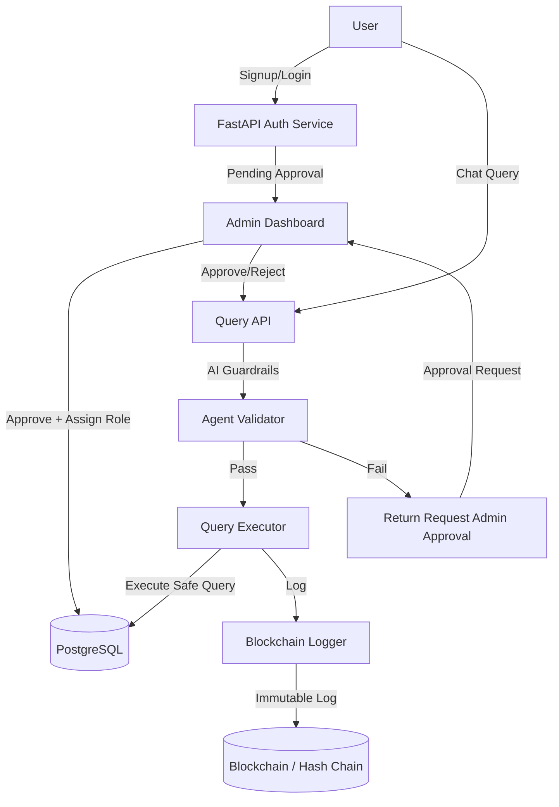
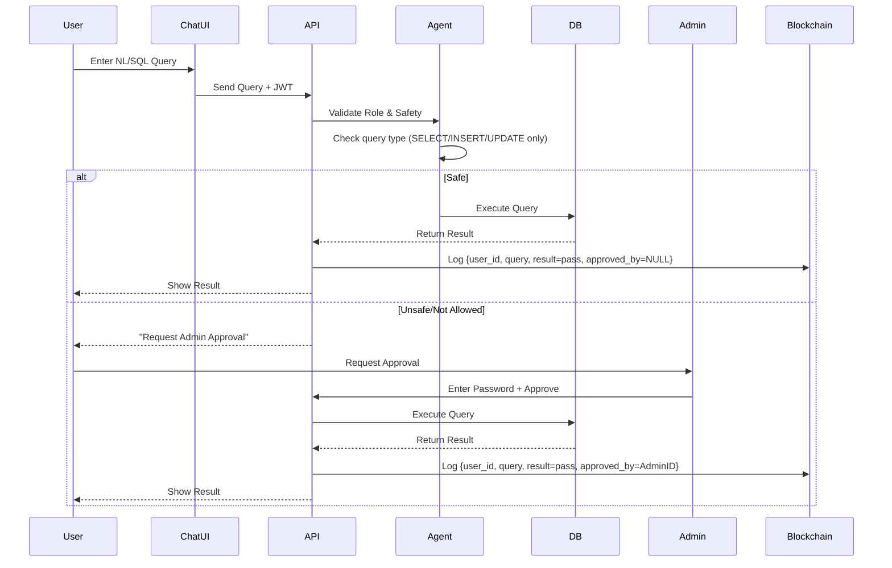
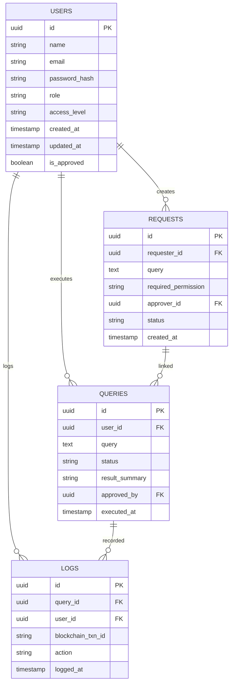
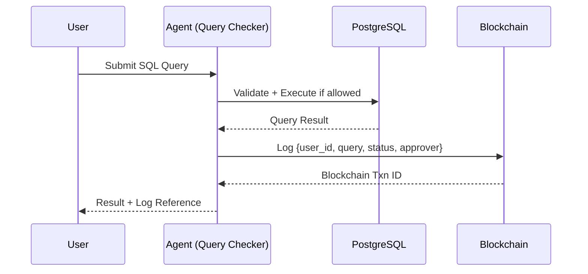

# 🚀 AI-SafeQuery MVP

## 🔥 Section 1: What Are We Building?

We’re building **AI-SafeQuery**, a governance and compliance layer that sits between users and the company database.
It allows **natural language + SQL queries** to be run safely with:

* Role-based permissions (RBAC)
* AI-powered safety checks
* Immutable blockchain logs
* Admin approval workflow

This MVP focuses on:

1. **Admin dashboard** → Approve users, assign roles
2. **User chat interface** → Query database via NL/SQL
3. **AI agent safety layer** → Guard against unsafe queries
4. **Blockchain logging** → Immutable record of every query (who ran it, what query, result, and who approved)

---

## 🎯 Section 2: MVP Scope (32h Build)

✅ User Signup/Login with JWT
✅ Admin role assignment (`reader`, `writer`, `admin`, `super_admin`)
✅ Chat interface for queries (SQL/NL)
✅ AI Guardrails (block DROP/ALTER/TRUNCATE, enforce RBAC)
✅ Query execution on PostgreSQL
✅ Blockchain-style logs with:

* User who ran query
* The query text
* Result (`pass` or `fail`)
* If approved → who approved
  ✅ Minimal Admin Dashboard (approve/reject users, assign roles, view logs)

---

## 🛠️ Section 3: API Routes & Database Schema

### 🛠️ Routes (FastAPI)

* **Auth**

  * `POST /auth/signup` → User signup
  * `POST /auth/login` → User login (JWT)

* **Admin**

  * `GET /admin/pending-users` → Fetch pending signup requests
  * `POST /admin/approve-user/{user_id}` → Approve + assign role
  * `POST /admin/reject-user/{user_id}` → Reject signup
  * `GET /admin/logs` → View blockchain logs

* **User/Query**

  * `POST /query` → Submit SQL/NL query (goes through agent validation)
  * `POST /query/request-approval` → Request admin approval for blocked query

---

### 🗂️ Database Schema (MVP)

```sql
-- Users
users (
  id SERIAL PRIMARY KEY,
  username VARCHAR(100),
  email VARCHAR(100) UNIQUE,
  password_hash TEXT,
  role VARCHAR(20), -- reader, writer, admin, super_admin
  status int DEFAULT 0 -- 0 pending/ 1 approved/-1 rejected
);

-- Query Logs (Blockchain-like)
query_logs (
  id SERIAL PRIMARY KEY,
  user_id INT REFERENCES users(id),
  query TEXT,
  result_status VARCHAR(10), -- pass / fail
  approved_by INT REFERENCES users(id), -- NULL if no approval
  timestamp TIMESTAMP DEFAULT NOW(),
  hash TEXT -- SHA256(user_id + query + result_status + approved_by + timestamp + prev_hash)
);
```

---

## 🏗️ Section 4: System Architecture



---

## ⚡ Section 5: Query Workflow



---

## 📜 Section 6: Blockchain Logging Design

Each query generates an **immutable log record** with:

* `user_id` → who ran the query
* `query` → SQL/NL text
* `result_status` → pass / fail
* `approved_by` → NULL or admin\_id
* `timestamp` → execution time
* `hash` → SHA256(user\_id + query + result\_status + approved\_by + timestamp + prev\_hash)

This creates a **tamper-proof hash chain**.


## 3. API Routes & Database Schema

### **Initial Routes (MVP)**

#### **Auth & User Management**

* `POST /auth/signup` → Register user (pending approval).
* `POST /auth/login` → Authenticate user.
* `GET /auth/me` → Get logged-in user info.

#### **Admin Panel**

* `GET /admin/users` → List pending/approved users.
* `POST /admin/users/{id}/approve` → Approve and assign role.
* `PATCH /admin/users/{id}/role` → Update user role/access.
* `POST /admin/db/init` → Initialize a company database (only admin/super-admin).

#### **Query Execution (Chat + API)**

* `POST /query/execute` → Run SQL query through agent (with permission check).
* `POST /query/request-approval` → Request elevated permission.
* `POST /query/approve` → Approve another user’s query request (with password confirmation).

#### **Blockchain Logs**

* `GET /logs/query` → Fetch query execution logs (from blockchain).
* `GET /logs/user/{id}` → Get user’s query history.

### **Database Schema**



---

## 4. Blockchain Logging

Every **query event** is logged into blockchain with:

* `user_id` → Who executed/requested.
* `query` → Full SQL query.
* `status` → Pass / Fail / Approved / Rejected.
* `approver_id` → If elevated approval was required.
* `timestamp` → When it happened.
* `blockchain_txn_id` → Transaction ID from blockchain.

### Suggested Blockchain Systems

* **Hyperledger Fabric** – Enterprise-grade, pluggable consensus, supports private channels.
* **Ethereum (private chain / Polygon Edge)** – Easier integration with smart contracts.
* **BigchainDB** – Database-like blockchain, supports high throughput logging.

### Logging Workflow



---

✅ With this structure, your MVP will:

1. Handle **user signup/login/approval**.
2. Enforce **role-based query execution**.
3. Provide a **chat interface with SQL agent**.
4. Log all operations into **blockchain for immutability**.


---


## 4. Tech Stack

### Frontend
- **React 19** – Admin dashboard + chat UI  
- **TailwindCSS** – Styling  
- **React Query (TanStack Query)** – API state management  
- **ShadCN/UI** (optional) – Prebuilt UI components  
- **Framer Motion** (optional) – Animations for chat/admin UI  

### Backend
- **FastAPI (Python)** – Core API layer  
- **Uvicorn/Gunicorn** – ASGI server  
- **SQLAlchemy + Alembic** – ORM + migrations  
- **Pydantic** – Data validation  

### Database
- **PostgreSQL** – Primary relational DB  

### Blockchain Logging
- **Polygon / Ethereum Testnet** – Immutable logging  
- **Web3.py** – Python SDK for blockchain writes  
- **Hyperledger Fabric (enterprise option)** – Private blockchain if compliance-heavy  

### AI Agent Layer
- **LangChain / LlamaIndex** – Schema-aware orchestration  
- **OpenAI / Mistral / Claude** – Text-to-SQL model  
- **Custom Safety Agent** – Dry-run & permission enforcement  

### Auth & Security
- **JWT** – Authentication  
- **OAuth2 (FastAPI)** – Role-based access  
- **bcrypt/argon2** – Password hashing  

### Deployment
- **Docker + Docker Compose** – Containerization  
- **Nginx** – Reverse proxy  
- **Kubernetes (Phase 3)** – Scaling multi-agent workloads  


## 5. Admin Dashboard

### MVP Admin Features
- Approve/reject new signups  
- Assign roles & access levels  
- Review pending query requests  
- View logs (with blockchain txn ID)  
- Manage company DB connections  

### Implementation Options
- **[FastAPI-Admin](https://github.com/fastapi-admin/fastapi-admin)** → Best fit, works directly with SQLAlchemy models  
- **Piccolo Admin** → Polished UI, alternative if ORM flexibility needed  
- **React-Admin (custom)** → More customization but takes longer  

👉 For MVP in 32 hours → **FastAPI-Admin** is recommended since it instantly generates CRUD dashboards from your models and integrates seamlessly with FastAPI.


# 🚀 MVP Plan – AI Query Agent with Blockchain Logging

## 🎯 Objective

Build a **minimum viable system** where:

1. Users can **submit queries** through an API/UI.
2. An **AI agent** translates queries into SQL safely.
3. Queries are **approved/rejected by an admin**.
4. Executed queries are **logged on blockchain** (pass/fail, short result, user ID, approver ID).
5. Admins manage **users, roles, requests, and logs** via an **auto-generated dashboard**.

---

## 🛠️ Core Scope (must-have in 32 hours)

### 1. User System

* Registration & login with JWT authentication.
* Roles: `user`, `admin`, `super_admin`.
* Only **admins** can approve requests.

### 2. Query Submission & Approval Flow

* **User submits query** → goes into `REQUESTS` table.
* **Admin reviews** → approve/reject.
* If approved → AI agent executes query safely → result stored.

### 3. Blockchain Logging

* For every executed query → log `{user_id, query, pass/fail, approved_by, txn_id}` to testnet blockchain.
* Keep only **short summary** of result (not full data).

### 4. Admin Dashboard (FastAPI-Admin)

* View/manage **Users, Requests, Queries, Logs**.
* Approve/reject queries in one click.

---

## ⚡ Routes (FastAPI)

### Auth

* `POST /auth/register` → Register new user
* `POST /auth/login` → Get JWT

### Query Workflow

* `POST /queries/submit` → Submit query (user)
* `GET /queries/pending` → List pending queries (admin)
* `POST /queries/{id}/approve` → Approve & execute query (admin)
* `POST /queries/{id}/reject` → Reject query (admin)
* `GET /queries/history` → View past queries (user/admin)

### Logs

* `GET /logs` → View blockchain logs (admin)

---

## 🗄️ Database Schema (Core)

* **USERS** → id, name, email, password\_hash, role, is\_approved
* **REQUESTS** → id, requester\_id, query, status, approver\_id, created\_at
* **QUERIES** → id, user\_id, query, status, result\_summary, approved\_by, executed\_at
* **LOGS** → id, query\_id, user\_id, blockchain\_txn\_id, action, logged\_at

---

## 🔗 Blockchain Logging (Simplified)

* Use **Polygon Mumbai Testnet**.
* Deploy minimal smart contract:

  ```solidity
  function logQuery(
      string memory userId,
      string memory queryHash,
      string memory status,
      string memory approverId
  ) public;
  ```
* Store txn hash in DB for reference.
* Only need `pass/fail` + `who approved`.

---

## 🎨 UI (Optional lightweight)

* Basic **React frontend**:

  * Login/Register
  * Query submission form
  * Query history list
* Admin just uses **FastAPI-Admin dashboard** (saves time).

---

## ✅ Deliverables in 32 Hours

1. **Backend (FastAPI)** with routes above
2. **SQLAlchemy models** + Alembic migrations
3. **JWT-based auth**
4. **AI agent stub** (OpenAI/Mistral text-to-SQL)
5. **Blockchain logger** (Polygon Mumbai testnet, txn hash)
6. **FastAPI-Admin setup** (CRUD for Users, Requests, Queries, Logs)
7. (Optional) Minimal React form for user query submission

---

🔥 With this scope, you’ll have:

* A working AI query agent
* Secure approval workflow
* Immutable blockchain audit trail
* Admin dashboard auto-generated
